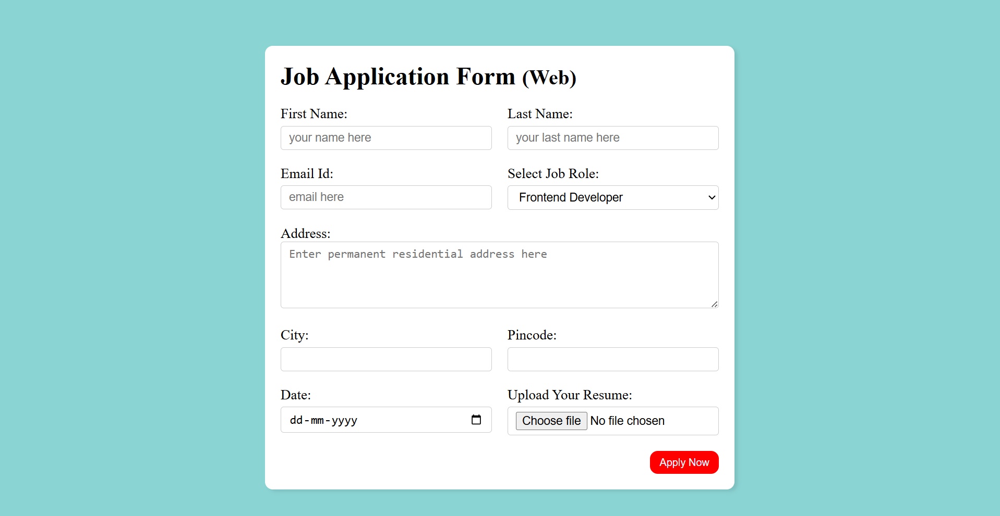

# 📝 Job Application Form - Webpage

This is a responsive Job Application Form built using **HTML5**, **CSS3**, and optional **JavaScript** for interactivity and validation. It is designed for employers or companies who want to collect applicant details via a web-based form.

## 🔍 Features

- Fully responsive design for mobile and desktop
- Clean and professional UI
- Input fields for:
  - First Name
  - Last Name
  - Email Address
  - Job Role selection
  - Resi Address
  - City
  - Pin Code
  - Date
  - Resume Upload
- Submit button with basic form validation
- Easy to customize and integrate into your existing project

## 📸 Preview



## 🚀 Live Demo

Check out the live version [here](https://ankitathorve.github.io/job-application-form/)

## 📂 Technologies Used

- HTML5
- CSS3

## 🛠 How to Use

**Clone the Repository**
   ```bash
   git clone (https://ankitathorve.github.io/job-application-form/)
